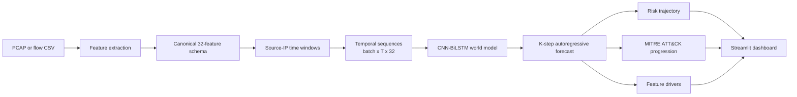

# AI Network Attack Forecaster

> **Forecast the next stage of an intrusion, not just the last suspicious flow.**

An offline Smart India Hackathon 2026 prototype for forecasting how network attacks may progress over time. The project converts PCAP or flow-CSV telemetry into temporal network states, learns state transitions with a CNN-BiLSTM world model, and presents a configurable multi-step risk forecast aligned with MITRE ATT&CK tactics.

> **Prototype status:** Forecasts are analyst prioritization signals for offline experimentation and demonstrations, not confirmed incidents or automated containment decisions.

## What it does

- Extracts flow-level and packet-level features from PCAP files, including TCP flags, TTL, payload statistics, port-scan entropy, and retransmission counts.
- Loads and cleans CIC-style flow CSV data, then maps known attack labels to MITRE ATT&CK tactics.
- Builds per-source-IP temporal sequences for next-state prediction.
- Trains a multi-task CNN–BiLSTM to predict the next network state, attack class, and tactic.
- Rolls the model forward autoregressively for a configurable *K*-step risk forecast.
- Provides a logistic-regression static-classification baseline.
- Includes a Streamlit dashboard design for offline visualisation of risk, attack-stage progression, and feature attribution.
- Includes a synthetic multi-stage PCAP generator for repeatable demonstrations.

## Architecture



```text
PCAP / CIC-style flow CSV
          |
          +--> feature extraction and label mapping
          |
          v
Time resampling by source IP + sliding windows (T x F)
          |
          +--> Logistic Regression baseline (single window)
          |
          v
CNN + BiLSTM world model
          |
          +--> next network state
          +--> attack class
          +--> MITRE ATT&CK tactic
          |
          v
K-step autoregressive forecast --> Streamlit dashboard
```

## Repository layout

```text
SIH_project_2026/
├── README.md
├── Document/
│   └── Architecture               # Full architecture document with diagrams
└── Tool/                          # Application source and runtime files
    ├── app/
    │   ├── app.py                 # Streamlit dashboard
    │   └── components.py          # Plotly dashboard components
    ├── baseline/logistic_regression.py
    ├── features/
    │   ├── pcap_extractor.py
    │   ├── extract_flows.py
    │   └── build_sequences.py
    ├── intelligence/kb_mapper.py
    ├── models/
    │   ├── world_model.py
    │   ├── train.py
    │   ├── inference.py           # K-step forecast implementation
    │   └── explain.py
    ├── scripts/
    │   ├── generate_synthetic_pcap.py
    │   └── benchmark_eval.py
    │   ├── prepare_dataset.py     # CIC-IDS2018 preparation
    │   └── train_demo_model.py    # World-model training entry point
    ├── Dockerfile
    ├── docker-compose.yml
    ├── data/02-28-2018.csv        # CIC-IDS2018 source data
    ├── data/processed/            # Generated balanced training data
    ├── requirements.txt
    └── run_pipeline.py
```

## Prerequisites

- Python 3.10 (the Docker image also uses Python 3.10)
- `pip`
- Docker Desktop (optional, for container deployment)

> The dependencies include TensorFlow, Scapy, SHAP, and Streamlit. A virtual environment is strongly recommended.

## Local setup

From the repository root:

```powershell
cd Tool
py -m venv .venv
.venv\Scripts\Activate.ps1
python -m pip install --upgrade pip
pip install -r requirements.txt
```

If PowerShell blocks virtual-environment activation, start PowerShell with an execution policy that permits local scripts, or use the virtual environment's Python executable directly.

All pipeline commands must be run from `Tool/`. This keeps local imports such as
`features.extract_flows` and `models.inference` resolvable and ensures generated
paths point to the `Tool/data/` directory.

To run a command without activating the environment:

```powershell
cd Tool
.venv\Scripts\python.exe run_pipeline.py --action evaluate
```

## Run individual components

All commands below are run from `Tool/`.

### Generate a synthetic attack capture

Creates `data/raw/synthetic_multi_stage_attack.pcap`, containing benign traffic followed by reconnaissance, initial access, lateral movement, and exfiltration activity.

```powershell
python scripts/generate_synthetic_pcap.py
```

### Test the static baseline

Runs a self-contained synthetic-data evaluation of the logistic-regression baseline.

```powershell
python -m baseline.logistic_regression
```

### Inspect the world-model architecture

Builds the CNN–BiLSTM graph and prints its Keras summary.

```powershell
python -m models.world_model
```

### Run the pipeline launcher

The project provides these actions:

```powershell
python run_pipeline.py --action generate
python run_pipeline.py --action train
python run_pipeline.py --action evaluate
python run_pipeline.py --action demo
python run_pipeline.py --action all
```

### Validate the installation

These checks confirm that the source files compile, the dashboard imports its
pipeline modules, and CSV ingestion can build the expected `(batch, T, 32)`
sequence tensor:

```powershell
cd Tool
.\.venv\Scripts\python.exe -m compileall -q app baseline features intelligence models scripts run_pipeline.py
.\.venv\Scripts\python.exe -c "from features.extract_flows import extract_features; from models.inference import forecast; print('imports passed')"
```

## Docker

Run these commands from `Tool/`:

```powershell
docker compose up --build -d
```

Open <http://localhost:8501> after the container becomes healthy. The compose
setup mounts `Tool/data/` read-only and keeps the trained model bundled in the
image. The large source dataset is excluded from the image build context.

Useful lifecycle commands:

```powershell
docker compose ps
docker compose logs -f sih-network-forecaster
docker compose down
```

## Data support

The ingestion design targets:

- Raw `.pcap` captures, parsed with Scapy
- CIC-IDS-2017 / CIC-IDS-2018-style flow CSV files
- CTU-13 and UNSW-NB15 after adapting column names to the expected feature schema

The CSV reader expects a `Timestamp` column and CIC-style labels. It cleans invalid numeric values, derives attack and tactic codes, and selects the available core traffic features.

### Prepared CIC-IDS2018 dataset

The repository includes `Tool/data/02-28-2018.csv`, a CIC-IDS2018 flow-data file with 613,104 records. Run the setup action once to create a compact, balanced local dataset at `Tool/data/processed/cicids2018_demo.csv`:

```powershell
python scripts/prepare_dataset.py
```

The prepared dataset samples up to 10,000 rows per label, adds a network-wide source identifier because the source file has no IP-address columns, and preserves chronological ordering. The Streamlit dashboard automatically selects it when available.

## MITRE ATT&CK tactic mapping

The current mapping uses these forecast stages:

| Code | Tactic |
| --- | --- |
| 0 | None / benign |
| 1 | Reconnaissance |
| 2 | Initial Access |
| 3 | Lateral Movement |
| 4 | Command and Control (C2) |
| 5 | Impact |
| 6 | Exfiltration |

Examples include PortScan → Reconnaissance, FTP/SSH brute-force and SQL injection → Initial Access, Bot → C2, and DoS/DDoS → Impact.

## Notes

- PCAP uploads are treated as unlabeled live telemetry and receive benign placeholder labels only for sequence construction.
- The dashboard uses a deterministic preview forecast until a checkpoint exists at `models/saved/best_world_model.keras`.
- The prepared dataset is a balanced demonstration subset; use `--max-sequences 0` when training on every available sequence.
- Missing or invalid timestamps are replaced with index-aligned fallback timestamps during CSV normalization, so pandas versions that reject a `DatetimeIndex` in `fillna()` are supported.
- If Scapy reports `No libpcap provider available`, PCAP parsing can still work through Scapy's pure-Python reader; install libpcap/Npcap when live capture support is required.

## Troubleshooting

### `ModuleNotFoundError` or `ImportError` from `app/app.py`

Run Streamlit from `Tool/` with the project interpreter:

```powershell
cd Tool
.\.venv\Scripts\python.exe -m streamlit run app/app.py
```

Running from the repository root or with a different Python installation can
hide the virtual-environment dependencies and make local packages unavailable.

### `TypeError` while filling timestamps

Use the current `features/canonical_schema.py` implementation and reinstall the
project dependencies if the environment is stale:

```powershell
cd Tool
python -m pip install -r requirements.txt
```

## Documentation

- [System architecture](Document/Architecture)

## Project context

This is an SIH 2026 prototype for proactive cyber defence. It is designed for offline experimentation and demonstration; it is not yet a production intrusion-detection or incident-response system.
